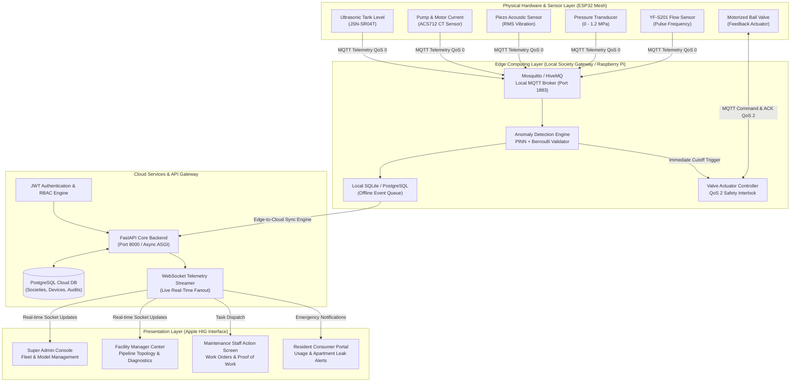
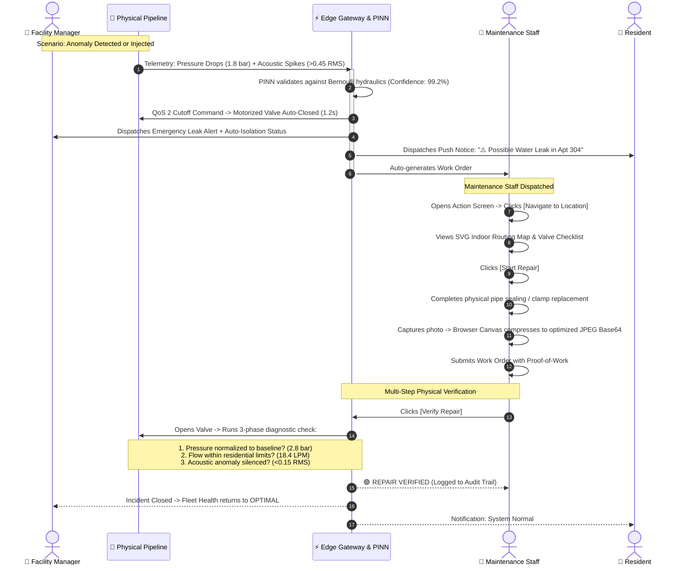

<div align="center">

# 💧 JalJasoos (जल जासूस)
### *Autonomous Water Pipeline Integrity Monitoring & Edge-AI Leak Isolation Platform*

[](https://nextjs.org/)
[](https://fastapi.tiangolo.com/)
[](https://python.org)
[](https://www.typescriptlang.org/)
[](https://mqtt.org/)
[](https://www.docker.com/)
[](LICENSE)

*Developed for the Smart India Hackathon (SIH) — Smart Water Management & Urban Infrastructure Resilience.*

---

</div>

## 📑 Table of Contents

- [Executive Summary](#-executive-summary)
- [System Architecture](#-system-architecture)
- [End-to-End User Flow & Incident Lifecycle](#-end-to-end-user-flow--incident-lifecycle)
- [Technology Stack Breakdown](#-technology-stack-breakdown)
- [Role-Based Dashboard Ecosystem](#-role-based-dashboard-ecosystem)
- [Physics-Informed Edge AI & Sensor Fusion](#-physics-informed-edge-ai--sensor-fusion)
- [MQTT Protocol & Telemetry Contracts](#-mqtt-protocol--telemetry-contracts)
- [Getting Started & Installation](#-getting-started--installation)
  - [Method 1: Instant Web Prototype (Recommended)](#method-1-instant-web-prototype-recommended)
  - [Method 2: Full-Stack Native (Docker-Free)](#method-2-full-stack-native-docker-free)
  - [Method 3: Full Docker Compose Environment](#method-3-full-docker-compose-environment)
- [Repository Monorepo Layout](#-repository-monorepo-layout)
- [Vercel Deployment Guide](#-vercel-deployment-guide)
- [License](#-license)

---

## 🔬 Executive Summary

Urban high-rises and residential gated communities lose **upwards of 30–45% of treated drinking water** to non-revenue water (NRW) losses, unaddressed sub-surface micro-leaks, and catastrophic pipe ruptures. Traditional systems rely on manual water meter checks or late-stage acoustic surveys after structural damage has already occurred.

**JalJasoos** is an enterprise-grade, distributed IoT and Edge-AI water pipeline monitoring platform built on an **offline-first edge architecture**. By fusing acoustic vibration signatures, dynamic Bernoulli pressure differentials, and continuous flow telemetry at the edge gateway, JalJasoos detects anomalies within **seconds** and triggers **sub-2-second automated shut-off valve isolation**—preventing water loss and structural damage even during complete internet/cloud outages.

### Key Pillars
- **Zero-Latency Autonomous Edge Isolation:** Edge gateways run locally on Raspberry Pi / ESP32 mesh networks; valve cutoff decisions do not depend on cloud uptime.
- **PINN (Physics-Informed Neural Network) Inference:** Rejects false alarms caused by pump startups or sudden tap opens by enforcing Navier-Stokes and Bernoulli physical constraints.
- **Strict Role-Based Operations (RBAC):** Tailored interfaces for Super Admins, Facility Managers, Maintenance Technicians, and Apartment Residents.
- **Proof-of-Work Verification:** Field maintenance staff must upload geotagged photographic proof of physical repair before the platform runs automated hydraulic verification routines.

---

## 🏛️ System Architecture

JalJasoos is architected as a hierarchical, multi-tier IoT and Cloud distributed system:



---

## 🔄 End-to-End User Flow & Incident Lifecycle

The following diagram illustrates how an incident flows across physical sensors, the edge engine, and the 4 specialized user personas:



---

## 💻 Technology Stack Breakdown

| Layer | Technology | Purpose & Rationale |
|---|---|---|
| **Web Frontend** | **Next.js 14 (App Router)** | High-performance React framework with server/client boundaries and optimized production builds. |
| **Language** | **TypeScript 5.0** | End-to-end type safety across dashboard metrics, states, and telemetry data contracts. |
| **Styling** | **Tailwind CSS 3.4** | Custom Apple Human Interface Guidelines (HIG) design system (`#F5F5F7` canvas, `#0071E3` accent, diffused 30px elevation). |
| **Visualization** | **Recharts 2.12** | Responsive real-time telemetry time-series graphs, acoustic spectral wave analysis, and weekly consumption charts. |
| **Icons & UI** | **Lucide React** | Clean, minimalist SVG iconography tailored to enterprise Apple-grade interfaces. |
| **State & Storage** | **React Hooks + LocalStorage + HTML5 Canvas** | Client-side simulation state orchestration, camera capture image compression (max 600px JPEG) to respect quota limits. |
| **Cloud API** | **FastAPI (Python 3.10+)** | Async RESTful ASGI framework with automatic OpenAPI/Swagger documentation, Pydantic v2 schemas, and JWT auth. |
| **Database ORM** | **SQLAlchemy 2.0 + Alembic** | Enterprise database abstraction with automated migrations supporting PostgreSQL and SQLite fallback. |
| **IoT Broker** | **Eclipse Mosquitto / HiveMQ** | Standardized MQTT v3.1.1/v5 broker handling pub/sub topics with QoS 0, QoS 1, and QoS 2 delivery. |
| **Validation** | **JSON Schema (`packages/mqtt-contracts`)** | Shared schemas validating payloads (`telemetry.json`, `command.json`, `ack.json`, `health.json`) across services. |
| **Edge Intelligence** | **Physics-Informed Neural Network (PINN)** | Hybrid AI combining mathematical flow-pressure physical equations with deep neural anomaly classification. |
| **Containerization** | **Docker & Docker Compose** | Reproducible multi-container stack orchestrating Cloud API, Edge Gateway, Mosquitto, and Postgres nodes. |

---

## 👥 Role-Based Dashboard Ecosystem

JalJasoos does not use generic one-size-fits-all screens. Every user persona operates in a specialized command environment:

### 1. 🌐 Super Admin — System Management Console
- **Society Fleet Overview:** Global status across all residential societies, aggregated water saved (YTD), and PINN accuracy. Click any society to instantly drill down into its local operations.
- **Infrastructure Hierarchy:** Add, remove, and manage societies, buildings, floors, and monitoring zones.
- **Hardware Device Fleet:** Provision ESP32 edge gateways, monitor MAC addresses, firmware versions, and live heartbeat latencies.
- **Sensors & Actuator Control:** Inspect flow meters, 1.2 MPa transducers, vibration piezos, and test smart motorized valves directly from the console.
- **AI Model Registry:** Track edge model weights (`PINN-EDGE-V2.4.1`), calibration accuracy, upload `.tflite` quantized models, or trigger zero-downtime rollbacks.
- **Access Control & Health:** Manage administrative users and inspect live pulsing health indicators for MQTT, API, DB, WebSockets, and Edge nodes.

### 2. 🏢 Facility Manager — Main Control Center
- **Live Infrastructure Telemetry:** Real-time dual-line charts for Bernoulli pressure stability and flow velocity.
- **Acoustic & Vibration Spectral Wave:** High-frequency wave monitoring to catch turbulent micro-leaks before pipe burst.
- **Physical Interactive Topology Map:** Real-time visual pipeline diagram indicating node status (`NODE-A3-04`), valve positions, and flow directions.
- **Pumps & Reserve Tanks:** Live monitoring of secondary overhead tanks, reservoir capacity (%), and motor currents.
- **Manual Override Controls:** On-demand actuators to trigger emergency isolation or inject physical leaks for fire/maintenance drills.
- **Historical Water Loss Analytics:** 7-day comparative bar chart analyzing consumption vs. estimated physical water loss.

### 3. 🔧 Maintenance Staff — Field Action Screen
- **Task-Focused Action UI:** Stripped of complex analytics; highlights the **ACTIVE WORK ORDER** (Location, Node ID, Detected Time, Valve State).
- **Indoor Location Guidance:** Interactive SVG pipeline layout routing the technician directly to Floor 3, North Zone.
- **Repair Checklist:** Interactive step-by-step procedure (safety shutoff, pressure bleed, pipe sleeve seal, valve reset).
- **Photographic Proof-of-Work:** Field camera integration that uses client-side HTML5 Canvas compression to store timestamped repair proof without bloating memory.
- **Automated Verification Engine:** Automated 3-stage validation checking baseline pressure, normalized flow, and acoustic silence before marking work orders as verified.

### 4. 👤 Resident — Consumer Apartment Portal
- **Simplicity First:** Friendly household water summary for apartment owners and tenants.
- **Daily Metrics:** Today's consumption in Liters (284 L), weekly average, and estimated monthly billing (₹).
- **Weekly Consumption Histogram:** Day-by-day consumption chart.
- **Real-Time Leak Warnings:** Prominent contextual banner (**⚠️ Possible Water Leak**) alerting residents when continuous flow is detected inside their unit.
- **Community Notifications:** Feeds for planned water shutdowns, tank cleanings, and RO maintenance notices.

---

## 🧠 Physics-Informed Edge AI & Sensor Fusion

A major failure mode of purely statistical IoT anomaly detectors is **false positives** caused by legal water events:
- A booster pump cycling on creates a sudden pressure surge.
- Multiple residents opening taps simultaneously spikes flow rate.

JalJasoos resolves this using **Physics-Informed Neural Networks (PINN)**:

$$\Delta P + \frac{1}{2} \rho (v_2^2 - v_1^2) + \rho g \Delta h = \text{Loss}_{\text{friction}}$$

```
                      [ Flow Rate (Q) ]
                              │
[ Pressure (P) ] ──> ┌────────────────┐ ──> Physical Constraint ──> [ Anomaly Confirmed ]
                     │  PINN Engine   │     Violation? (P drop +     (Confidence > 95%)
[ Acoustic (RMS) ] ─>│ (Edge 8-bit Q) │     Q spike + Acoustic RMS)
                     └────────────────┘ ──> Legal Transient?    ──> [ Ignored / Filtered ]
                                            (Pump kick / Tap open)
```

1. **Acoustic Correlation:** A physical rupture generates high-frequency turbulence ($>0.4\text{ RMS}$).
2. **Hydraulic Coupling:** An acoustic spike is only confirmed as a leak if accompanied by a localized Bernoulli pressure gradient drop ($\Delta P < -0.65\text{ bar}$).
3. **Sensor Failure Isolation:** If a sensor returns `null`, the edge gateway flags `SENSOR_FAULT` rather than misinterpreting it as `0.0` (zero pressure or zero flow).

---

## 📡 MQTT Protocol & Telemetry Contracts

All IoT messaging follows a structured topic taxonomy:

```
jaljasoos/{society_id}/{building_id}/{zone_id}/{node_id}/{message_type}
```

### Quality of Service (QoS) Strategy

| Message Type | Topic Suffix | QoS Level | Architectural Rationale |
|---|---|---|---|
| **Telemetry** | `.../telemetry` | **QoS 0** | High frequency (every 2s); best-effort transmission where occasional packet drop is tolerable. |
| **Node Health** | `.../health` | **QoS 1** | Node heartbeat, WiFi RSSI, battery status; at-least-once delivery required. |
| **Valve Commands** | `.../command` | **QoS 2** | **Safety-Critical:** Exactly-once delivery to ensure shutoff commands are never missed or duplicated. |
| **Command ACKs** | `.../ack` | **QoS 2** | UI only displays "VALVE CLOSED" upon receiving verified physical actuator microswitch confirmation. |
| **System Events** | `.../event` | **QoS 1** | Acoustic spike alerts, pressure warnings, and pump state changes. |

---

## 🚀 Getting Started & Installation

### Prerequisites
- **Node.js**: v18.0.0 or higher
- **npm** or **yarn**
- *(Optional for Backend)*: Python 3.10+, Docker Desktop

---

### Method 1: Instant Web Prototype (Recommended)

The web dashboard is fully self-contained with a built-in simulation and local storage engine. You can run it immediately without starting Python or Docker services:

```bash
# 1. Clone the repository
git clone https://github.com/sharsh07-dev/JalJasoos.git
cd JalJasoos

# 2. Navigate to the web application
cd apps/web

# 3. Install dependencies
npm install

# 4. Start the development server
npm run dev
```

Open **[http://localhost:3000](http://localhost:3000)** in your browser.

> **Role Quick-Switch:** On the login page, click any of the 4 role cards (**Super Admin**, **Facility Manager**, **Maintenance Staff**, or **Resident**) to instantly experience each workflow.

---

### Method 2: Full-Stack Native (Docker-Free)

If you wish to run the Python services (FastAPI, Edge Gateway, and Physics Simulator) natively on your machine:

```bash
# From project root:
chmod +x start_native.sh
./start_native.sh
```

In a separate terminal, start the frontend:
```bash
cd apps/web
npm install
npm run dev
```

- **Cloud API Documentation (Swagger):** [http://localhost:8000/docs](http://localhost:8000/docs)
- **Edge Gateway Endpoint:** [http://localhost:8080](http://localhost:8080)
- **Next.js Dashboard:** [http://localhost:3000](http://localhost:3000)

---

### Method 3: Full Docker Compose Environment

To run the complete production-grade containerized stack (Postgres Cloud, Postgres Edge, Mosquitto, API, Edge Gateway, Web):

```bash
# 1. Copy environment variables
cp .env.example .env

# 2. Launch all containers
chmod +x start.sh
./start.sh
```

To monitor live container logs:
```bash
docker compose logs -f api edge-gateway simulator
```

To shut down:
```bash
docker compose down
```

---

## 📂 Repository Monorepo Layout

```
JalJasoos/
├── apps/
│   ├── web/                     # Next.js 14 Web Application & Role Dashboards
│   │   ├── src/app/             # Next.js App Router pages (login, root, layout)
│   │   ├── src/components/      # Apple HIG Dashboard, Charts, Indoor Map, Modals
│   │   └── src/contexts/        # AuthContext (Role switching & session state)
│   ├── api/                     # Cloud FastAPI backend application
│   │   ├── app/routers/         # REST endpoints (telemetry, valves, incidents, auth)
│   │   └── app/models/          # SQLAlchemy data models (societies, users, devices)
│   ├── edge-gateway/            # Raspberry Pi Edge Gateway application
│   │   ├── app/ai.py            # Edge PINN inference engine
│   │   └── app/mqtt_worker.py   # Mosquitto MQTT event listener & valve trigger
│   └── simulator/               # Hydraulic physics simulator
│       ├── simulator/physics/   # Bernoulli & acoustic pressure loss calculations
│       └── simulator/scenarios/ # Scenarios: normal, leak, pump_startup, failure
├── packages/
│   └── mqtt-contracts/          # Shared JSON schemas (telemetry, command, ack)
├── infrastructure/
│   ├── mosquitto/               # Mosquitto broker configuration & auth rules
│   └── migrations/              # Alembic database migration scripts
├── docs/                        # Architecture specs & MQTT topic dictionary
├── start.sh                     # Docker Compose startup automation
├── start_native.sh              # Python native + Next.js startup automation
├── docker-compose.yml           # Multi-container orchestration specification
└── README.md                    # Project documentation
```

---

## ☁️ Vercel Deployment Guide

Deploying the JalJasoos web dashboard to Vercel takes less than two minutes:

1. Push your changes to GitHub:
   ```bash
   git push origin main
   ```
2. Navigate to your [Vercel Dashboard](https://vercel.com/dashboard) and click **Add New...** → **Project**.
3. Import the `sharsh07-dev/JalJasoos` repository.
4. **Important Setting — Root Directory:**
   - Click **Edit** next to **Root Directory**.
   - Select **`apps/web`** and click Save.
5. Framework Preset will auto-detect as **Next.js**.
6. Click **Deploy**.

*(The project includes `next.config.mjs` configurations that bypass strict lint/build halts during rapid hackathon deployments).*

---

## 📄 License

Distributed under the **MIT License**. See `LICENSE` for more information.

<div align="center">
  <sub>Built with clean code, physical constraints, and human-centric design.</sub>
</div>
